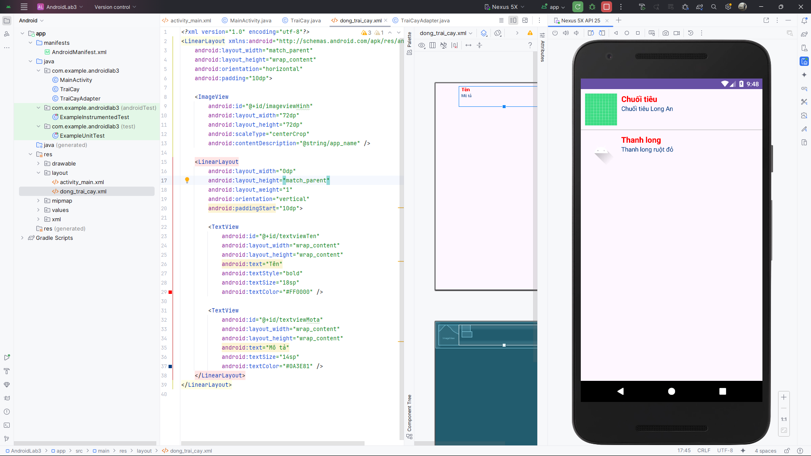

# AndroidLab3

## Overview
AndroidLab3 is an Android application project designed to demonstrate various Android development concepts. The project includes examples of custom adapters, layouts, and other Android components.

## Features
- **Custom Adapter**: Implements a custom adapter for displaying a list of items.
- **Layouts**: Includes multiple layouts such as `activity_main.xml` and `dong_trai_cay.xml`.
- **Drawable Resources**: Contains various drawable resources for different screen densities.
- **Java Classes**: Includes classes like `MainActivity`, `TraiCay`, and `TraiCayAdapter`.

## Project Structure
```
AndroidLab3/
├── app/
│   ├── build.gradle.kts
│   ├── proguard-rules.pro
│   ├── src/
│   │   ├── main/
│   │   │   ├── AndroidManifest.xml
│   │   │   ├── java/com/example/androidlab3/
│   │   │   │   ├── MainActivity.java
│   │   │   │   ├── TraiCay.java
│   │   │   │   ├── TraiCayAdapter.java
│   │   │   ├── res/
│   │   │   │   ├── layout/
│   │   │   │   │   ├── activity_main.xml
│   │   │   │   │   ├── dong_trai_cay.xml
│   │   │   │   ├── drawable/
│   │   │   │   ├── mipmap-*/
│   │   │   │   ├── values/
│   │   │   │   ├── values-night/
│   │   │   │   ├── xml/
│   │   ├── test/
│   │   │   ├── java/com/example/androidlab3/
│   │   │   │   ├── ExampleUnitTest.java
│   │   ├── androidTest/
│   │   │   ├── java/com/example/androidlab3/
│   │   │   │   ├── ExampleInstrumentedTest.java
├── build.gradle.kts
├── gradle.properties
├── gradlew
├── gradlew.bat
├── settings.gradle.kts
```

## Getting Started

### Prerequisites
- Android Studio
- Java Development Kit (JDK)
- Gradle

### Setup
1. Clone the repository:
   ```bash
   git clone <repository-url>
   ```
2. Open the project in Android Studio.
3. Sync the Gradle files.
4. Run the application on an emulator or a physical device.

## How to Use
- The main activity displays a list of items using a custom adapter.
- Modify the `TraiCay` class to add more items to the list.
- Update the layouts in the `res/layout` directory to customize the UI.

## Contributing
Contributions are welcome! Please fork the repository and submit a pull request.

## License
This project is licensed under the MIT License. See the LICENSE file for details.

## Acknowledgments
- Android documentation
- Open-source libraries used in the project